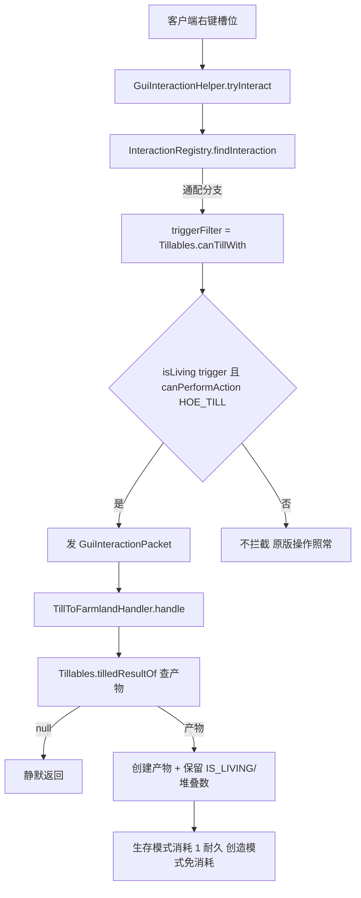

## 产品概述

排查并修复「活锄头耕活泥土 → 活耕地」对第三方模组锄头的兼容性，同时把可耕目标从单一 `dirt` 扩展到原版锄头能耕的全部土方块。

## 现状结论（已核实）

**当前不兼容**模组锄头，两处硬编码卡死：

1. `LivingItem.java` 只为 6 种原版锄头各注册一条精确交互规则，`InteractionEntry.triggerItem` 只接受具体 `Item`，模组锄头不在清单内，客户端不拦截、不发包。
2. `TillToFarmlandHandler.isHoe` 用 `instanceof HoeItem`，自实现工具类的锄头即便过了第一关也被拒。
活化本身无门槛（`isLivingItem` 只看 `IS_LIVING` 组件，任意物品都能活化），缺的只是「锄头」的语义判定。

## 核心功能

- **模组锄头兼容**：锄头判定改为语义判定 —— 仅用 NeoForge 约定的 `ItemStack#canPerformAction(ItemAbilities.HOE_TILL)`（用户已定口径）。原版 6 种锄头经 NeoForge patch 自动满足，硬编码清单删除；重写了 `IItemExtension#canPerformAction` 的模组锄头（含多工具合一型）自动识别；未声明该 ItemAbility 的锄头本次明确不覆盖。
- **拦截面收窄**：改用「通配条目 + `triggerFilter`」注册（与现有 `plant_crop` 同构）。通配分支不校验 `isLiving(trigger)`，故过滤谓词内必须自查活物品，否则非活锄头也会被拦截并吞掉原版拿起/分堆操作。
- **可耕目标扩展**：新增「目标方块 → 产物方块」映射，逐条注册交互规则 —— `dirt`/`grass_block`/`dirt_path` → `farmland`；`coarse_dirt`/`rooted_dirt` → `dirt`（可再耕一跳变活耕地）。产物一律保留 `IS_LIVING` 与堆叠数。
- **范围说明**：原版口径中 `podzol`（灰化土）与 `mycelium`（菌丝）查无 tilling 条目，判定为原版不可耕，默认**不纳入**；若需要须显式定口径（建议映射到 farmland）。物品层交互无世界上下文，原版「缠根泥土掉落垂根」的世界副作用不做。
- **一致性**：创造模式沿用现有「不消耗耐久」，但光标的锄头校验与生存模式统一（与 `PlantCropHandler` 一致，防止恶意客户端绕过）；`hurtAndBreak` 对不可损坏的模组锄头内部静默跳过，不会报错。

## 技术栈

沿用项目现状：Minecraft 1.21.1 + NeoForge 21.1.x（Java 21）、NeoForge `ItemAbilities` / `IItemStackExtension#canPerformAction`、项目自有的 `InteractionRegistry` 声明式交互框架、JUnit 5 + MDG unitTest（FML 环境）。无新依赖。

## 实现方案

**策略**：把「什么是锄头」与「什么土能耕成什么」两个知识从注册处/处理器里抽到活耕地领域的一个内聚类中，注册处改为「按可耕目标逐条注册通配条目 + 过滤谓词」，处理器改为「查表 + 统一校验」。



**关键技术决策**

1. **只用 `canPerformAction(ItemAbilities.HOE_TILL)`**：NeoForge 官方自定义工具文档要求重写 `IItemExtension#canPerformAction`，这是跨模组的唯一语义化口径；不做 `instanceof HoeItem` / 自建 tag / 配置白名单兜底（用户已定）。代价：自实现且未声明 ItemAbility 的锄头仍不认——已接受。
2. **通配条目 + `triggerFilter`** 而非扩展 `InteractionEntry` 字段：`InteractionEntry` 是 record，新增字段会波及全部构造点与 `findInteraction` 语义；`triggerFilter`（`BiPredicate<trigger,target>`）正好是现有「按类匹配」的表达手段，且 `plant_crop` 已有成功先例。过滤谓词同时被客户端拦截与服务端校验复用，单一真源。
3. **不改 `findInteraction` 的活物品校验**：精确分支校验 `isLiving(trigger)`、通配分支不校验是既有语义（`plant_crop` 依赖它），改动会影响其它通配条目；本次由 `Tillables.canTillWith` 自查 `isLiving`，与 `PlantCropHandler.canPlantWith` 保持同构。
4. **一个目标一条条目**：`InteractionEntry` 只能表达一个 `targetItem`，沿用现有 `for` 循环注册写法；产物映射放在领域类，注册处只遍历 `Tillables` 的目标集。
5. **产物映射表 vs 复用原版 `getToolModifiedState`**：后者需要真实 `UseOnContext`（世界/玩家/坐标），GUI 物品交互没有世界上下文；用静态 `Map<Item,Item>` 更轻、可单测，且与原版映射一致。

**性能与可靠性**：`canPerformAction` 为 O(1) 无副作用调用，仅在右键拦截时执行一次，无热路径影响；`Tillables` 用静态不可变 `Map`，无每次分配。错误处理沿用「静默返回」风格（不匹配即不拦截），不引入新日志噪声。

## 执行要点（防回归）

- 通配条目**必须**在 `canTillWith` 内先查 `LivingItemManager.isLivingItem(trigger)` 再查 ItemAbility —— 顺序反了不会出错，漏了则非活锄头也会被拦截并吞点击（`InteractionEntry` javadoc 已记录该事故类型）。
- 生产注册发生在 `commonSetup`，测试用 `InteractionRegistry.clearForTest()` 隔离静态表（见 `InteractionRegistryTest` 的 `@BeforeEach`/`@AfterAll` 约定）。
- 目标方块校验从 `dirt.is(Items.DIRT)` 换成查表后，务必保留「目标必须是活物品」的校验（`isLivingItem(target)`），否则会把普通土也耕了。
- 耐久：`hurtAndBreak` 对非 damageable 物品内部静默跳过，无需额外判空；保持创造模式不消耗。
- 现有全量基线 **297 用例全绿**，改动后需保持；新增测试挂到活耕地/交互领域。

## 架构设计

领域知识内聚到 `living/domain/farmland/`，注册与处理两层都只调用它，不再各自硬编码：

```
Tillables（领域：锄头判定 + 可耕映射）
   ↑                    ↑
LivingItem（注册规则：按目标逐条通配注册 + 引用过滤谓词）
TillToFarmlandHandler（服务端：查表取产物 + 复用同一过滤谓词校验光标）
```

## 目录结构

```
src/main/java/com/qiqi/li/
├── living/domain/farmland/
│   └── Tillables.java                       # [NEW] 活耕地领域内聚的「耕作」知识：
│                                            #   · isHoeLike(ItemStack)：仅 canPerformAction(ItemAbilities.HOE_TILL)
│                                            #   · canTillWith(trigger, target)：客户端拦截 + 服务端校验共用门槛
│                                            #     （先查 isLivingItem(trigger)，再查 isHoeLike）
│                                            #   · TILLED_RESULTS：不可变 Map<Item,Item> 可耕映射
│                                            #     dirt/grass_block/dirt_path → farmland；coarse_dirt/rooted_dirt → dirt
│                                            #   · tilledResultOf(ItemStack)：目标物品 → 产物 Item（非可耕返回 null）
│                                            #   · tillableTargets()：供注册处遍历的目标集合
├── living/interaction/
│   └── TillToFarmlandHandler.java           # [MODIFY] 移除 instanceof HoeItem 与写死的 DIRT/FARMLAND：
│                                            #   目标校验改为 Tillables.tilledResultOf + isLivingItem；
│                                            #   光标校验统一走 Tillables.canTillWith（创造模式仅免耐久消耗）；
│                                            #   产物按查表结果构造，保留堆叠数与 IS_LIVING
└── LivingItem.java                          # [MODIFY] 注册处（约 268-274 行）：删除 6 种原版锄头硬编码清单，
                                             #   改为遍历 Tillables.tillableTargets() 注册通配条目
                                             #   （triggerItem=null, triggerFilter=Tillables::canTillWith）

src/test/java/com/qiqi/li/living/domain/farmland/
└── TillablesTest.java                       # [NEW] 判定的回归守卫：原版 6 锄头（活）通过 / 非活锄头不通过 /
                                             #   非锄头活物品（如活剑）不通过 / 映射表逐项断言 / 非土方块返回 null

src/test/java/com/qiqi/li/living/interaction/
└── TillToFarmlandCompatTest.java            # [NEW] 规则层与处理器层回归：各可耕目标 + 活锄头命中 till_to_farmland；
                                             #   非活锄头不拦截（null）；coarse_dirt 产物为 dirt 且保留活标记与堆叠数；
                                             #   沿用 InteractionRegistry.clearForTest() 与 docs/guides/unit-testing.md 测试替身约定

docs/
├── tech/living-farmland-tech.md             # [MODIFY] §3.1 由「6 种锄头精确规则」改为「ItemAbility 语义判定 + 可耕映射表」，
                                             #   §11 新增坑位（通配条目须自查 isLiving）、§12 实测清单补模组锄头与新目标
├── system-design/gui-interaction-system.md  # [MODIFY] 处理器表格行 TillToFarmlandHandler 口径更新
├── reference/file-map.md                    # [MODIFY] 新增文件登记
└── ../AGENTS.md                             # [MODIFY] 最近更新条目追加本次变更（结论 + 指针）
```

## Agent Extensions

### SubAgent

- **code-explorer**
- 用途：全仓排查「锄头 / DIRT→FARMLAND」是否还有第三处硬编码（tooltip、活耕地放置 `LivingFarmlandPlacement`、文档清单、创造模式相关处理），避免只改两处留下遗漏的判定点。
- 预期产出：一份受影响文件清单（含行号），确认改动链闭合、无漏网点。